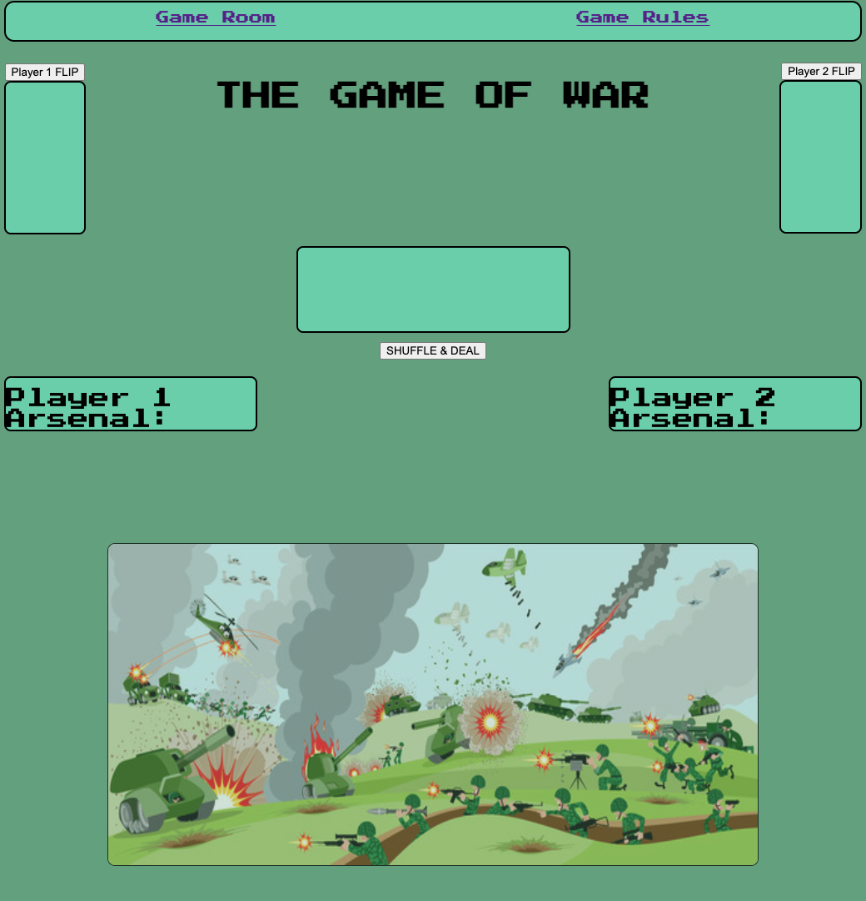
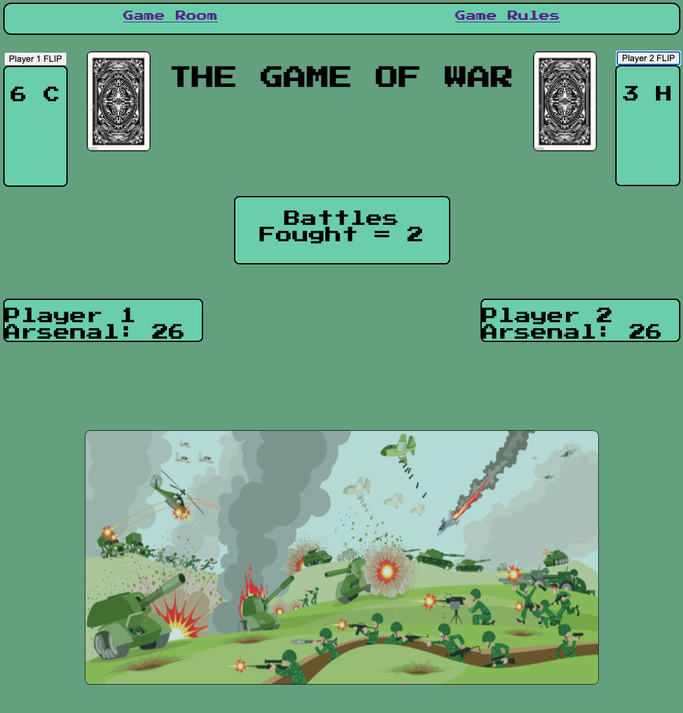
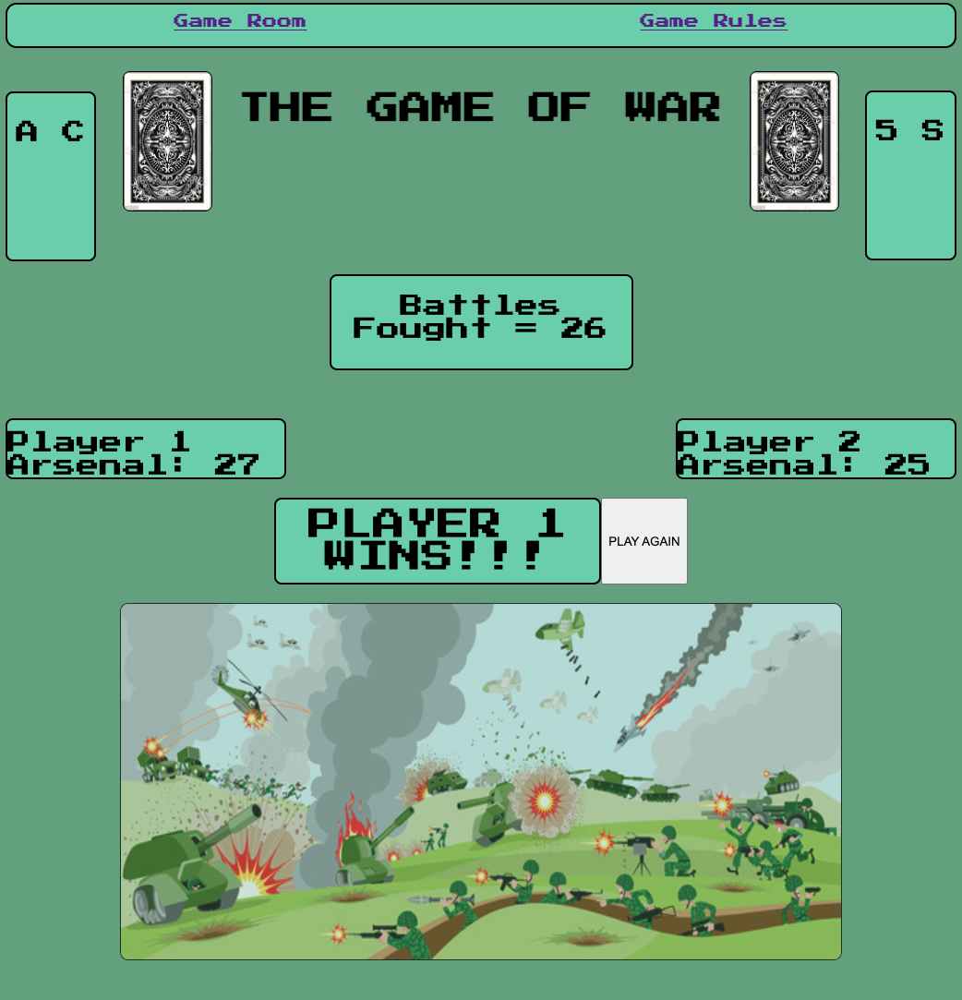
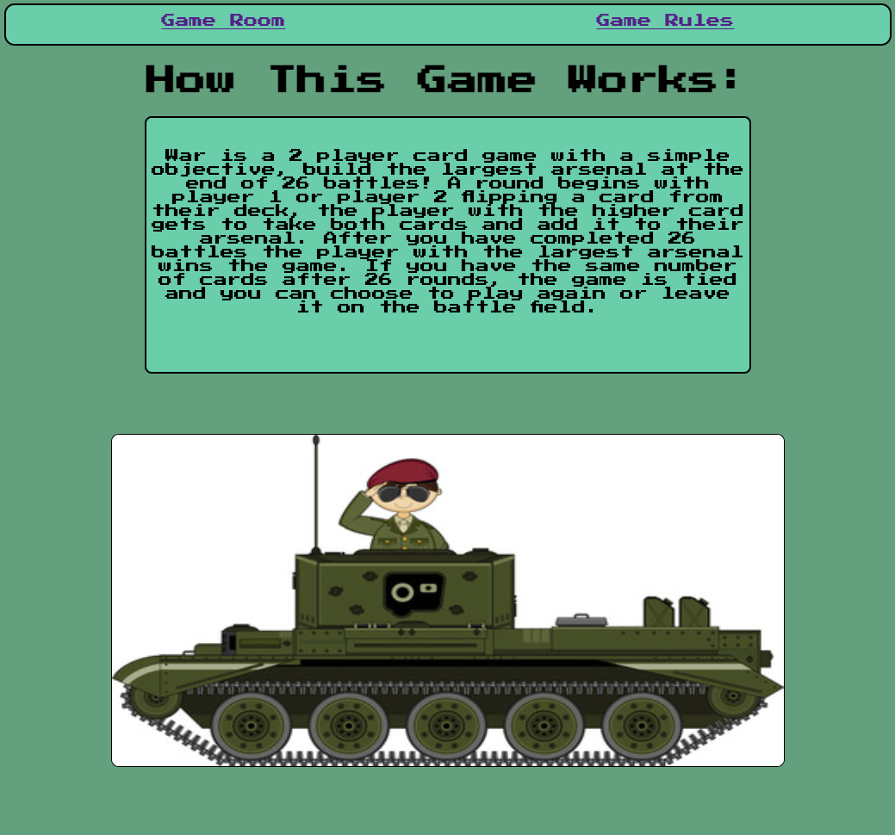

# THE GAME OF WAR

The game of war is a two player browser based game card game.  This version of the game runs for 26 rounds or 'battles'.  During each battle a player flips a card from the top of their deck and the player with the highest scoring card wins the battle and adds both cards to their arsenal.  If players flip a card with the same score, neither player collects additional cards and the played cards move to the back of their decks.  The winner at the end of 26 battles is determined by who has the biggest arsenal at the end of those rounds. If the arsenals are the same size, there is a tie.

# Images of the Game:

# Tech Used

HTML, CSS, JAVASCRIPT, FLEXBOX, GOOGLE FONTS 

# Getting Started

https://justingracie.github.io/Card-Game-War---JG/

See the 'Game Rules' page for instructions on how the game works.

# Next Steps

In a future version of this game I'd like to add additional battle scenarios.  When players draw a card of the same score during a battle, I'd like to start a new battle where each player draws 4 addtional cards that compares the scores of the 4th card.  The player with the higher cards adds all 8 to their arsenal. Additionally after 26 battles, If the players arsenals are the same size I would like to initiate a sudden death round highest cards wins the game. I would also like to add some animation to the game in future versions, maybe the battle scene in the game room isn't a static image, but one with movement (even if just a short animated loop).