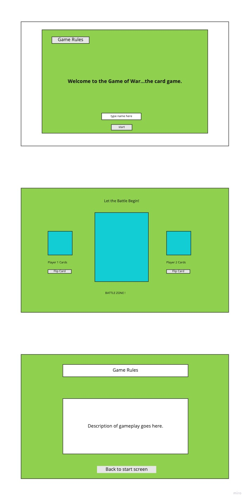

# GAME OF WAR

# Project Description

This will be a browser based 2 player card game.  A full deck of cards gets split up between two players, for each round of play the players will flip a card from their respective decks.  The player with the highest card takes both cards and adds them to their deck (cards are scored on face value, Ace being highest, suits do not matter.)  If both players flip a card with the same face value this initiates a 'war'.  In this scenario players will place three cards face down and a fourth card face up, the higher of the face up card takes them all, if flipped cards are of the same face value again both players will place three more cards down and flip a fourth until a winner is reached.  If one play doesn't have enough cards to participate in a 'war' then they automatically lose the game.  Otherwise, the player who collects all of the cards in the deck wins the game. 

# Planning Process

Start with a basic layout in HTML and CSS to construct various pages and board games based on wireframes.  Then in JS I will start by creating objects that will hold the deck of cards and a function to deal the deck out randomly between two players.  Create logic to identify winners for each round, and end of Game scenario. 

# User Story

-As a user, you enter the site from a start screen. From here you can read about the game rules linked by a button, or simply start playing the game by entering  your name and clicking start.  Player two will be able to enter their name from the gameboard. 

-After names are entered cards will be dealt and users will use the flip card button to flip a card from their deck, the player with the higher face value card will collect both cards and add them to their deck. 

-Rounds of play will continue until one player is out of cards and a winner is determined. 

-If a 'war' is initiated, players will click draw again and three face down cards will appear with a fourth card face up.  The winner takes all cards and adds them to their deck. Play continue until one player has no cards. 

# MVP Goals

-two player setup.
-about page with directions.
-play again function to reset the game with current players.
-let tie be a tie
-Winner has most wins after 26 rounds

# Stretch Goals

-play against computer option.
-dynamic background.
-alternative play style (32 card setup), big stretch. 
-animation of cards flipping.
-styling
-'War scenario'

# Wire Frame

